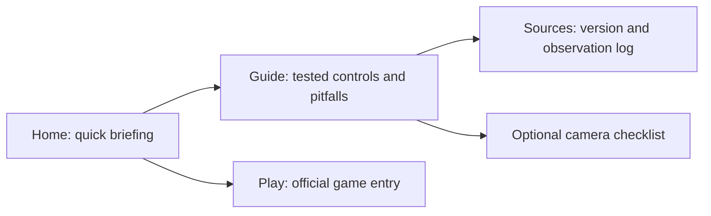

# Shift repair plan — 2026-10-08

P0 player task: identify the actual anomaly on a camera and clear it without mistaking the status text or this companion for the running game.

| Route | Intent | Primary information | Action | Fallback |
|---|---|---|---|---|
| / | Understand and start | Official game identity, concise controls, screenshot | Open official game or guide | Direct official itch page |
| /guide/ | Resolve actual control confusion | Natural browser observations + version-specific source behavior | Follow checks, open official game | Explicit unknowns, source link |
| /play/ | Reach current game | Official entry; no mirrored game claim | Open itch | Browser/reload notes without save assurances |
| /updates/ | Verify guide evidence | Source URL, capture date, observed/tested scope | Inspect official source | Clearly state no future-build guarantee |
| /about/, /privacy-policy/, /terms/ | Understand site behavior | Actual authorship, local checklist and links | Contact / navigate | noindex, outside sitemap |
| /camera-guide/, /anomaly-guide/, /survival-tips/ | Existing links | Consolidated controls/observations now live in guide | Follow guide link | noindex correction page, no unsupported advice |

Keep only independently useful indexable pages. Replace risk formula with simple user-controlled camera notes (no score, timer-based survival claim or game integration). Inspect source and run actual game before claiming tested behavior. Keep the original styling and mobile layouts; no new game facts from design templates. User authorized publication after real review; deployment will follow root review.
